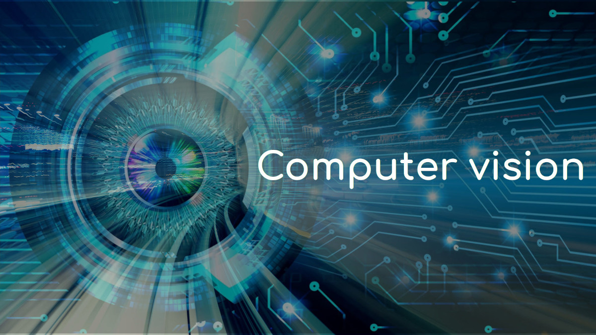

  

## Index 
- Course 1 : Computer Vision and ML basics: Visual (local) feature detection and description, Bag of Word Image representation, Linear classification (SVM)
- Course 2 : Introduction to Neural Networks (NNs)
- Course 3 : Machine Learning basics (2): statistical decision theory and Risk minimization, ERM and regularization, connection with weight decay and maximizing the margin in SVM
- Course 4 : Neural Nets for Image Classification
- Course 5 : Neural Nets for Image Classification, Vision Transformers
- Course 6 : Transfer learning and domain adaptation
- Course 7 : Segmentation and Detection
- Course 8 : Generative models with GANs
- Course 9 : Generative models with diffusion
- Course 10 : Large VL models: CLIP, StableDiffusion, Flamingo
- Course 11 : Explainable AI, Fairness
- Course 12/13 : Bayesian deep learning
- Course 14 : Robustness
